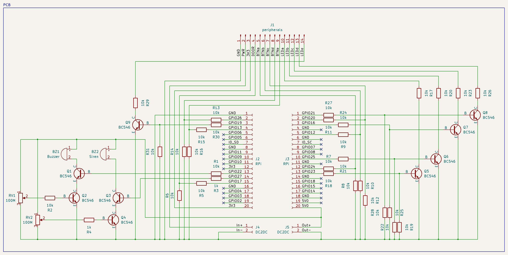
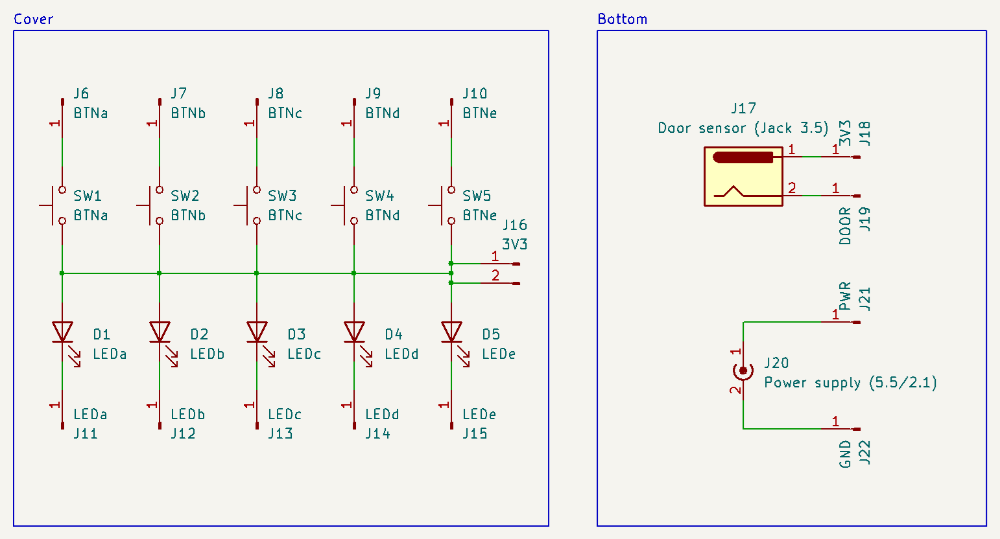
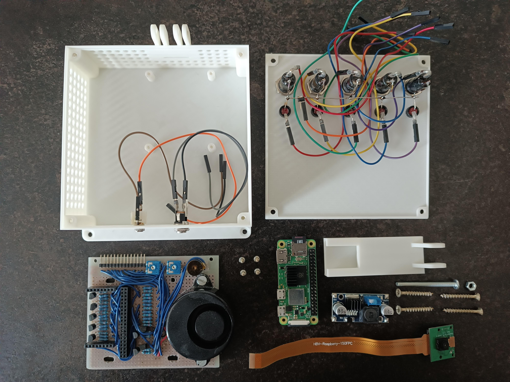
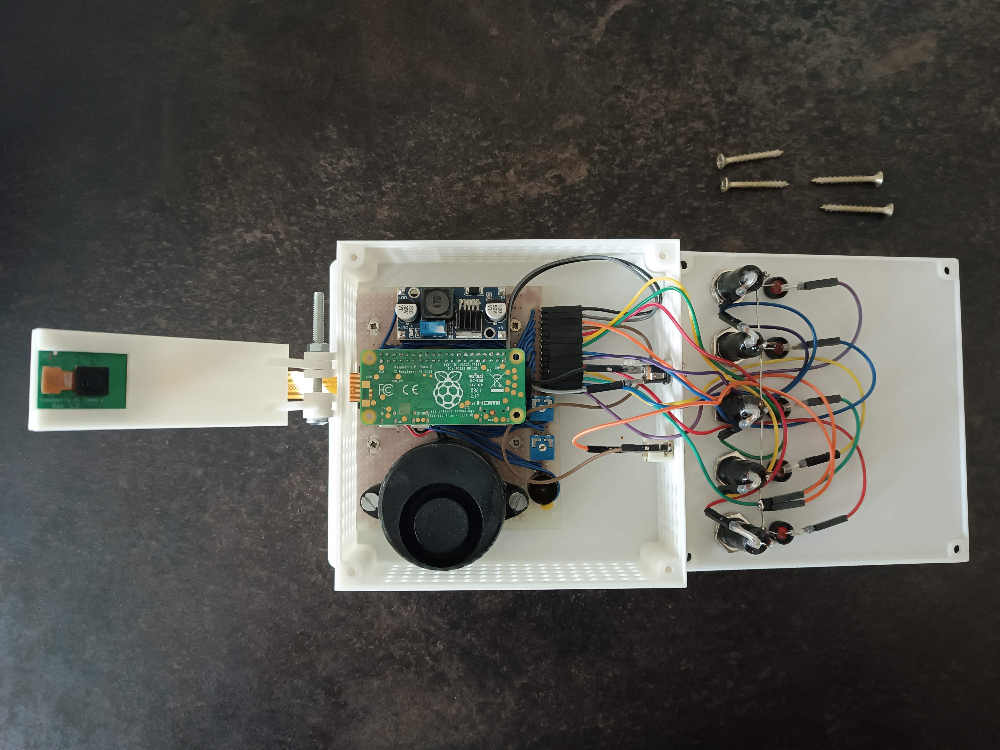
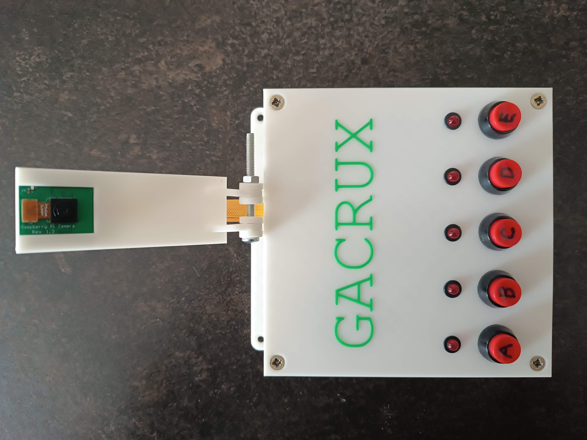

# Door sensor

This is the documentation of Door sensor, an application that enables to create a door sensor from a Raspberry Pi. This door sensor can work offline or can be connected to an MQTT broker!

The following steps describe the installation of Door sensor on Raspberry Pi.

## Hardware build

The door sensor consists of a Raspberry Pi Zero 2 WH micro computer with additional electronic components allowing the micro computer to control the door sensor. Below, you can see the door sensor circuit schemes (also available in the `.kicad_sch` format):





The repository also includes printable 3D models (`.stl` files) of cases for the PCB. To mount the PCB to the case, you need 4 2.5×10mm screws. To assembly the case, you need 4 3.5×30mm screws. You also need 1 M4×30mm metric screw and 1 M4 nut in case you want to mount the camera holder. In case you don't want to edit the model, following components are recommended to be used if they are to fit into the holes in the case:
- PBS-11B-R as the button ([link here](https://www.gmelectronic.com/v/1501016/pbs-11b-r-tlacitko-do-panelu-1-pol-offon))
- JC-204 as the Jack 3.5mm connector ([link here](https://www.gmelectronic.com/v/1497212/ninigi-jc-204-jack-35-mono))
- DS-026B as the power supply connector ([link here](https://www.gmelectronic.com/v/1498555/ds-026b-dc-connector-55-21))
- L-53LSRD as LEDs ([link here](https://www.gmelectronic.com/v/1491570/kingbright-l-53lsrd-led-5mm-cervena), regarding the required color and brightness, pick correspinding resistors `R17`, `R19`, `R21`, `R23` and `R25`)
- BL-C2 HR04C2 as LED sockets ([link here](https://www.gmelectronic.com/v/1492931/bright-led-bl-c2-hr04c2-objimka-pro-led-5mm))

Below, you can see an example of the built hardware:







## Install the prerequisite software

### Install Node.js

1. Connect to the device through SSH.
2. Switch to `root` through `sudo su`.
3. Install Node.js and npm:
```
curl -sL https://deb.nodesource.com/setup_21.x | sudo bash -
apt update
apt upgrade
apt install nodejs
```

## Install the app

### Prepare the UNIX user

1. Connect to the device through SSH.
2. Switch to `root` through `sudo su`.
3. Create the new user `door-sensor`:
```
adduser door-sensor
```
4. Add user `door-sensor` to group `gpio`:
```
usermod -a -G gpio door-sensor
```

### Prepare the file system

1. Create the `/var/door-sensor` directory:
```
mkdir /var/door-sensor
chown door-sensor:door-sensor /var/door-sensor
```
2. Copy the content of this folder to the directory `/var/door-sensor`.

### Customize `door-sensor.service`

1. Set the environment variable `APP_MQTT_ENABLED` to `true` to enable the communication with an MQTT broker.
2. Depending on the configuration of MQTT broker, set `APP_MQTT_PROTOCOL` to `mqtt` or `mqtts`. In case of `mqtts`, it's necessary to put the certificate files into the directory `/var/door-sensor` and don't forget to set their filenames into `door-sensor.service`:
```
APP_MQTT_CA_FILENAME=rootCA.crt
APP_MQTT_CERT_FILENAME=mysite.crt
APP_MQTT_KEY_FILENAME=mysite.key
```
3. Set the MQTT broker password encoded in base64.
4. Depending on which pins the buttons, door sensor, signal diodes, beeper and siren are connected to, adjust the pin numbers in `door-sensor.service`.

### Install NPM modules and start the app

1. Install npm modules:
```
su - door-sensor
cd /var/door-sensor
npm install
exit
```
2. Enable and start the `door-sensor` service:
```
systemctl enable /var/door-sensor/door-sensor.service
systemctl start door-sensor
```

## RPi Camera integration

In case a Raspberry Pi Camera module v 1.3 is connected, it's also possible to use the device as a camera. In that case, follow the software installation instructions from the [RPi Camera repository](https://github.com/elinucknack/rpicamera).

### Usage

After the connection to the MQTT server, the door sensor sends its state every 15 seconds and after the state change using the `door-sensor-topic/state` topic.

The door sensor state contains the following data:
- `notificationTrigger` (ON/OFF)
- `sirenTrigger` (ON/OFF)
- `siren`: (ON/OFF)
- `delayedSirenTriggerOn`: (ON/OFF)
- `delayedSirenOn`: (ON/OFF)
- `doorState`: (OPEN/CLOSE)
- `timestamp`: (Unix time in seconds)

You can enable the notification trigger using the `door-sensor-topic/notification-trigger-on` topic.

You can disable the notification trigger using the `door-sensor-topic/notification-trigger-off` topic.

You can enable the siren trigger using the `door-sensor-topic/siren-trigger-on` topic.

You can disable the siren trigger using the `door-sensor-topic/siren-trigger-off` topic.

You can switch off the siren using the `door-sensor-topic/siren-off` topic.

## Authors

- [**Eli Nucknack**](mailto:eli.nucknack@gmail.com)
